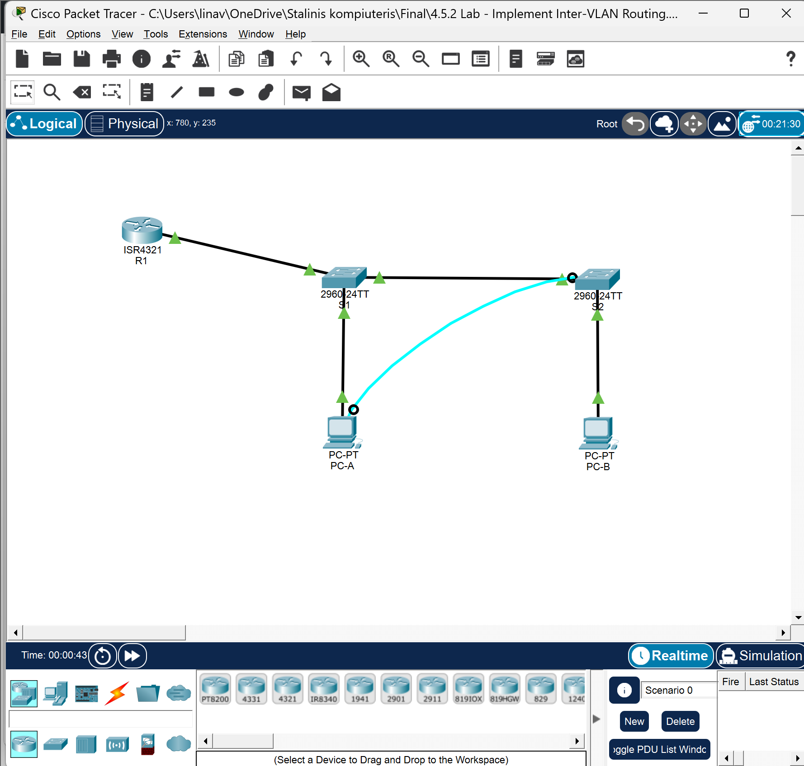

# Cisco CCNA: Switching, Routing, and Wireless Essentials (SRWE)

This repository showcases practical networking work completed as part of the Cisco CCNA Switching, Routing, and Wireless Essentials (SRWE) project at Atlantic Technological University.

The project was completed using Cisco Packet Tracer and included hands-on configuration, implementation, verification, and troubleshooting of switched, routed, secured, and wireless networks.

## Example Network Topology

The topology below is from the completed Inter-VLAN Routing lab.

## Skills and Technologies

- Cisco Packet Tracer
- Cisco IOS
- VLANs and VLAN Trunking
- Inter-VLAN Routing
- Router-on-a-Stick
- Spanning Tree Protocol (STP)
- EtherChannel
- DHCPv4 and DHCPv6
- IPv4 and IPv6
- Static and Default Routing
- HSRP
- Port Security
- Switch Security
- SSH
- Wireless LANs (WLAN)
- Wireless LAN Controller (WLC)
- WPA2 Enterprise
- Network Troubleshooting

## Practical Work

During the project, I completed a range of Packet Tracer labs involving:

- Configuring Cisco switches and routers
- Configuring VLANs, trunks, and inter-VLAN routing
- Implementing and troubleshooting EtherChannel
- Configuring DHCPv4 and DHCPv6
- Configuring IPv4 and IPv6 static and default routes
- Implementing port and switch security
- Configuring wireless networks and WLANs using a WLC
- Troubleshooting routing, VLAN, EtherChannel, and wireless connectivity issues
- Testing and verifying network connectivity using Cisco IOS commands

## Tools

- Cisco Packet Tracer
- Cisco IOS CLI

## Project Period

June 2026 – August 2026

## About

This repository is part of my technical portfolio and demonstrates practical experience gained while completing the Cisco CCNA SRWE networking project.
